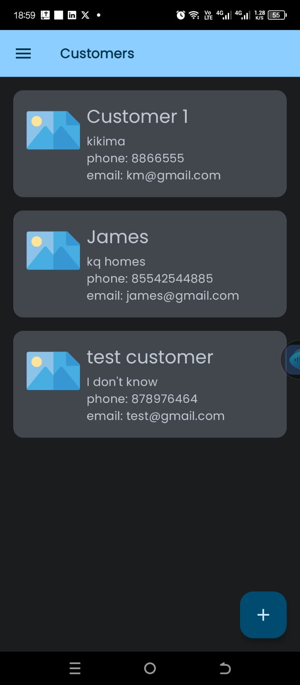
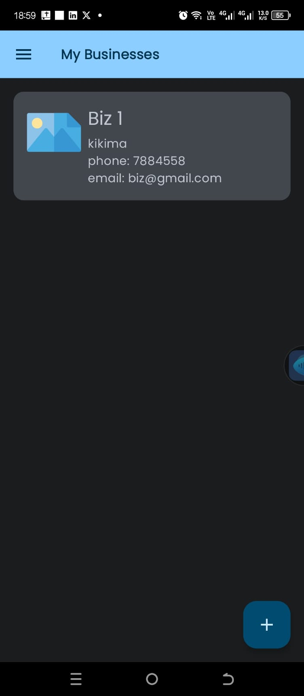
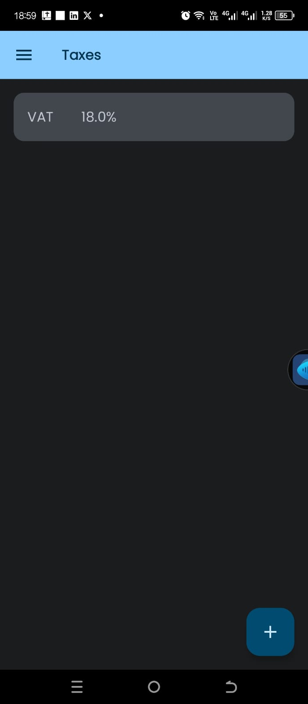
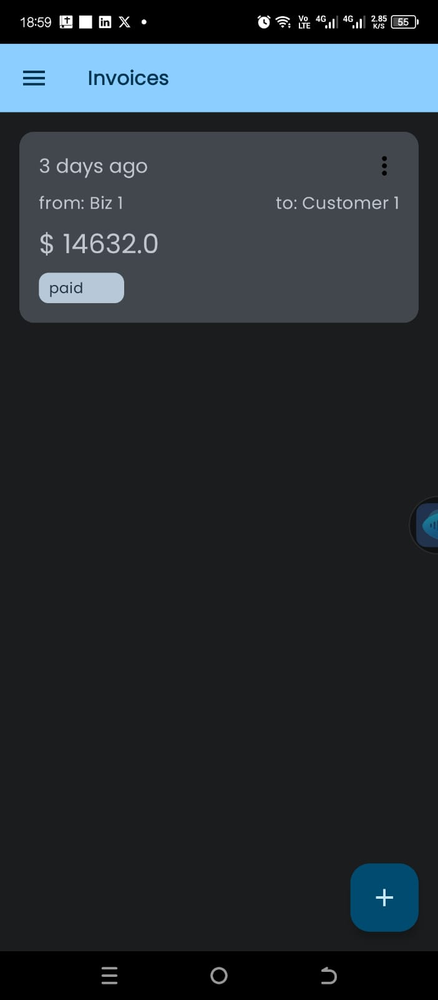

# Invoice App

It is an application to create and manage invoices. One need to create an account and login into the
application. Once logged in they will view a dashboard highlighting some statistics if the data 
exists. 

You need `google-services.json` to make this project work.

## Follow these steps
- Go to https://console.firebase.google.com/
- You can signup with your google account.
- If you already have a project in firebase you can use it or you can create a new project.
- Once you have your firebase project, make sure you enable **Firestore and Authentication with Email and Password**.
- Once the project is created, select android app as the option to add a new app. You need to fill the package name that is `app.easyinvoice`
- After adding the app you can download the config file that is `google-services.json`.
- Now you can clone this repository and paste the file inside app folder.
- That's it sync your project with gradle files and it should work.

In the event that no data exists, one would create them in their respective screens. 

They includes 
 **Creating a customer**

  

 **Creating a business**

  

 **Creating a tax** 

  

 **Creating an invoice**

  

